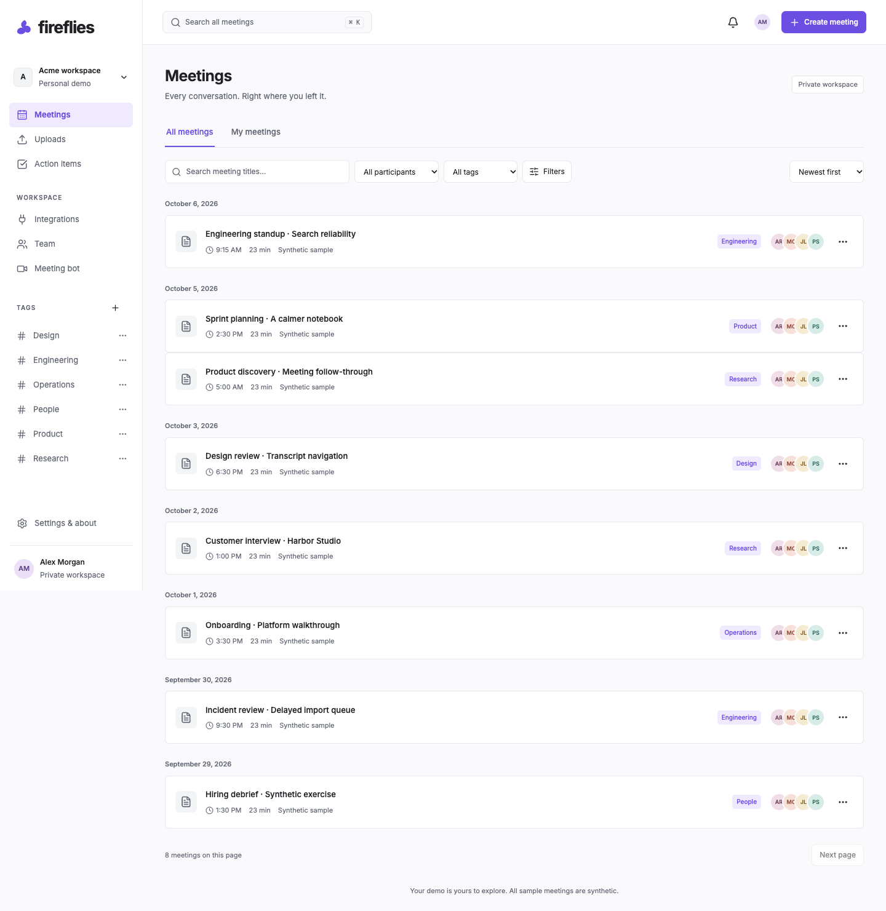
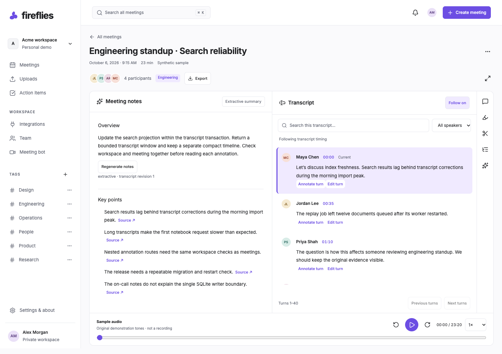

# Meeting workspace

An original, unofficial Fireflies-inspired meeting workspace using Next.js, FastAPI, local SQLite and remote Turso libSQL. Not affiliated with Fireflies. Use synthetic content only; anonymous workspaces are not production account authentication.

Framework dependencies are pinned in the npm and uv lockfiles: Next.js 16.3.8, FastAPI 0.142.2, SQLAlchemy 2.1.3, Alembic 1.20.0, and OpenAI Python 3.24.0.

## Local development

Requires Node.js 24 (tested with 24.5.0), npm 11, Python 3.13 (tested with 3.13.5), and uv 0.12.23. Install uv with `python3 -m pip install uv==0.12.23` in a tooling virtual environment if needed.

Copy `backend/.env.example` to `backend/.env` and `frontend/.env.example` to `frontend/.env.local`. Generate two separate secrets using `python3 -c "import secrets; print(secrets.token_hex(32))"`. Leave both TURSO variables blank for local SQLite. Set the same INTERNAL_API_TOKEN in both files and SESSION_SIGNING_SECRET only in the frontend file. Do not commit these files.

```sh
cd backend
uv sync --frozen
uv run alembic upgrade head
uv run uvicorn app.main:app --reload --port 8000 --no-access-log
```

In another terminal:

```sh
cd frontend
npm ci
npm run dev
```

Open [the local workspace](http://localhost:3000). Backend readiness is [available here](http://127.0.0.1:8000/health/ready).

## Checks

```sh
cd backend
uv run ruff check .
uv run ruff format --check .
uv run mypy app
uv run pytest
uv run pytest --libsql
```

```sh
cd frontend
npm run format:check
npm run lint
npm run typecheck
npm test
npm run build
npm run test:e2e
```

Docker Compose uses a named volume for the database. Set the environment files before running `docker compose up --build`. See the [deployment and operations guide](docs/deployment.md) for exact Turso Free, Render Free and Vercel Hobby dashboard instructions, persistence checks, and current verification limits.

AI is disabled by default. Extractive mode works immediately; OpenAI requires backend configuration and explicit user consent. No live provider request has been verified.

Database schema, seed behavior, backup and restore: [database guide](docs/database.md).

## Meeting library

The library supports title, attendee, tag, date, and duration filters; recent/oldest/title ordering; cursor pagination; and URL restoration. Tags, notifications, action-item completion, and theme/timezone/player preferences persist through the API.



Run frontend unit tests with `npm test` and browser checks with `npm run test:e2e`. Browser checks use installed Google Chrome locally; CI uses Playwright Chromium. Both services must be running with `APP_ORIGIN=http://localhost:3000`.


## Notebook features

Create meetings from pasted transcripts, timed manual turns, TXT, VTT, or JSON. Edit metadata, attendees, speakers, and transcript turns with version-conflict recovery. Use synchronized playback, literal transcript search, source links, and timed chapters. Save personal notes and actionable tasks; regenerate grounded summaries while preserving edited, completed, and manual work.

Comments, Unicode range highlights, and named soundbites persist in the configured SQLite/libSQL database. Global FTS search finds title/transcript evidence with speaker/time context. The meeting assistant saves questions and cited answers, with a working OpenAI adapter and a clearly labelled local extractive mode. TXT, Markdown, and PDF exports provide explicit numbered parts for long meetings.



Read the [evaluation walkthrough](docs/evaluation.md), [architecture](docs/architecture.md), [API](docs/api.md), [import formats](docs/imports.md), [intelligence and exports](docs/intelligence.md), [design references](docs/design.md), and [security review](docs/security.md).

From the repository root, run `node scripts/audit_npm.mjs`, `backend/.venv/bin/pip-audit`, `python3 scripts/scan_secrets.py`, and `python3 scripts/check_client_secrets.py` after building. The npm gate retains one documented unpatched development-only glob advisory; runtime findings fail the check. GitHub Actions is configured to run the checks and browser suite without live AI credentials.


## Verification and publication status

Checked locally on October 6, 2026: **79 backend tests, 10 frontend unit tests, and 9 browser workflows passed**, along with lint, formatting, strict type checks, migration drift checks, and the production build. The same saved meeting, manual task, transcript, and notes survived backend restart. A clean locked Python production install/import and PDF rendering/extraction checks passed. Tested library/notebook views had no serious/critical axe findings.

| Deliverable | Status |
| --- | --- |
| Local application | Available at [localhost:3000](http://localhost:3000) while both servers run |
| Public repository URL | Pending GitHub target and authenticated publication access |
| Hosted application URL | Pending Vercel Hobby/Render Free projects, Turso libSQL credentials and hosted verification |
| Hosted restart/BFF verification | Pending deployment; local restart and BFF workflows passed |
| Container execution | Compose and Render schema validate; Docker engine startup must be completed before local image execution can be verified |
| Live OpenAI | Not configured or verified; adapter tested with deterministic provider mocks |
| GitHub Actions | Configured; remote run awaits repository publication |

No public URL, CI badge, hosted persistence result, or live-AI success is claimed. The project is ready for those external verification steps; it is not yet a fully published submission. Follow [deployment.md](docs/deployment.md) for exact configuration, container checks, backup/restore, secret rotation, and live acceptance procedures.

## Free deployment database mode

Production requires backend-only `TURSO_DATABASE_URL` and `TURSO_AUTH_TOKEN`; the URL must identify a libSQL database. It uses the pinned `libsql==0.1.11` client over HTTPS without a local replica. With both variables blank, development continues to use `DATABASE_URL=sqlite:///./meeting-workspace.db`. The free Blueprint keeps `LLM_PROVIDER=disabled`. Internal service tokens and frontend session signing remain unchanged.

Read the [deployment guide](docs/deployment.md) for driver test evidence, free-tier limits, remote backup/restore, and exact dashboard steps. Run `scripts.verify_database` against Turso and the expanded `scripts.persistence_probe` before/after a real Render restart and redeploy. Local compatibility is not a claim of hosted verification.

October 7 adaptation checks: **92 backend tests passed on SQLite and 92 on the actual local libSQL engine**, plus 9 browser workflows. The expanded local backend restart probe retained meetings, tasks, annotations and search. Remote Turso transport and hosted Render/Vercel verification remain pending; see the deployment guide for precise boundaries.
