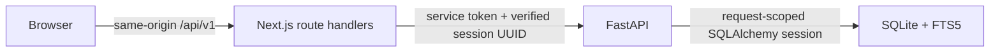

# Architecture

Next.js owns presentation, signed anonymous cookies, CSRF and Origin validation, security headers, and a route/method allowlist. It does not access SQLite. Cookie signatures, expiry, format, and purpose are checked on every browser request. Pre-session tokens avoid creating a database workspace on a GET.

FastAPI owns validation and relational writes. Every business resource resolves its workspace through a trusted service-authenticated session and membership. UUIDs are identifiers, not authorization. The backend does not enable browser CORS. Synchronous endpoints use request-scoped sessions; no SQLAlchemy Session is shared concurrently. Mutable requests reserve the single SQLite writer before reading versions and checking storage limits. Exceptions roll back the transaction.

Public response models omit internal workspace and secret fields. OpenAPI is generated from those models and TypeScript contracts are generated from OpenAPI. Library retrieval reads metadata with batched participant/tag queries and never includes transcript bodies. Keyset cursors include the selected filters' fingerprint and a deterministic ID tie-breaker.

SQLite migrations define normalized records, composite scope keys, and FTS projection triggers. Import creation, seed cloning, and task reassignment are atomic. The anonymous session has a thirty-day lifetime; cookie loss creates a new isolated workspace without deleting the old one.

The deployment boundary is one backend instance with a persistent disk. Backups use SQLite's consistent online backup API. This design does not support unrestricted horizontal write scaling.
