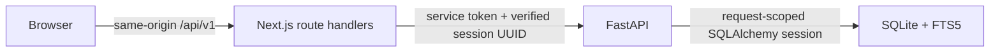
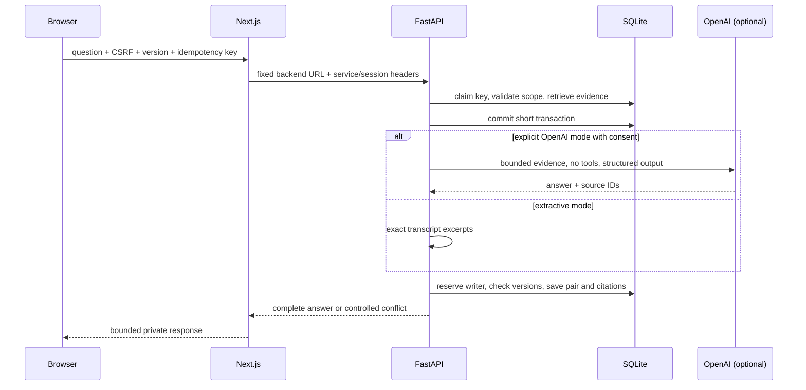

# Architecture

Next.js owns presentation, signed anonymous cookies, CSRF and Origin validation, security headers, and a route/method allowlist. It does not access SQLite. Cookie signatures, expiry, format, and purpose are checked on every browser request. Pre-session tokens avoid creating a database workspace on a GET.

FastAPI owns validation and relational writes. Every business resource resolves its workspace through a trusted service-authenticated session and membership. UUIDs are identifiers, not authorization. The backend does not enable browser CORS. Synchronous endpoints use request-scoped sessions; no SQLAlchemy Session is shared concurrently. Mutable requests reserve the single SQLite writer before reading versions and checking storage limits. Exceptions roll back the transaction.

Public response models omit internal workspace and secret fields. OpenAPI is generated from those models and TypeScript contracts are generated from OpenAPI. Library retrieval reads metadata with batched participant/tag queries and never includes transcript bodies. Keyset cursors include the selected filters' fingerprint and a deterministic ID tie-breaker.

SQLite migrations define normalized records, composite scope keys, and FTS projection triggers. Import creation, seed cloning, and task reassignment are atomic. The anonymous session has a thirty-day lifetime; cookie loss creates a new isolated workspace without deleting the old one.

The deployment boundary is one backend instance with a persistent disk. Backups use SQLite's consistent online backup API. This design does not support unrestricted horizontal write scaling.

The meeting notebook requests transcript pages of at most 60 turns and a separate compact timeline of at most 3,000 entries. The player uses binary search by `(start_ms, ordinal)` to locate the current turn; follow mode selects a nearby page instead of mounting the complete text. Wheel, touch, and transcript navigation keys suspend follow. Mobile views hide panels without unmounting the player or search state. Simulated playback uses a monotonic clock; bundled sample audio uses the media element's `currentTime`. Neither mode claims to be a meeting recording.

Annotations use meeting-scoped references and author checks. Highlight positions are Unicode code-point offsets; browser DOM UTF-16 selection offsets are converted before submission. The server verifies the exact selected text against the referenced segment version. Transcript pages batch-fetch only compact highlight ranges for their loaded turns, keeping response payloads bounded. Comments and highlights paginate with a 512 KiB response budget; soundbites are named intervals, not audio clips. Interval playback stops at the saved boundary using the same shared player, and its download contains timestamped complete overlapping transcript turns.

## Retrieval, generation, and response budgets

The provider runs outside the SQLite writer transaction. A 30-second provider deadline fits within the BFF's 40-second backend timeout and the route's 60-second function allowance. Two global operation leases bound concurrent generation; three consecutive provider failures trigger a 60-second cooldown. Failed operations do not save partial chat pairs. Current source IDs are validated, but semantic accuracy still requires human judgment.

Library pages stop below a 750 KiB item budget; transcript and annotation pages use 512 KiB budgets. Every BFF JSON response is checked below 1 MiB, and downloadable files below 4 MiB. These limits count UTF-8 bytes, not string length. Exports split all content into explicit numbered parts before PDF/text generation. Participant options use pages of at most 100 and a workspace cap of 500. There are at most 100 tags and 500 combined annotations per meeting. The physical SQLite page budget accounts for indexes and ancillary content in addition to logical transcript quotas.

The player first finds the latest start with binary search, then checks earlier overlapping turns if that candidate has ended. This bounded overlap check preserves the currently speaking turn; a real gap uses the latest prior turn as labelled context. Scroll containers establish positioning boundaries for hidden labels so accessibility elements cannot inflate the page height.
