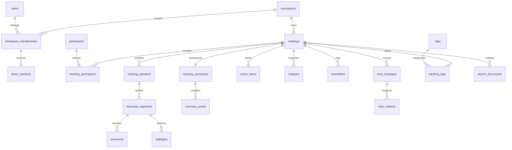

# Database

SQLite runs on one disk-backed backend instance. Each connection enables foreign keys, WAL, `busy_timeout=5000`, and `synchronous=FULL`. Writes reserve the SQLite writer before checking quotas. Database schemas are managed with Alembic, never with runtime table creation.

Public resources use UUIDs. Transcript/search rows also have integer indexing keys. Composite foreign keys include workspace and, where necessary, meeting IDs. An attendee cannot own a task in another meeting; a segment cannot reference another meeting's speaker. Triggers enforce duration boundaries, exact Unicode highlight ranges, and deletion cleanup.



Search uses an external-content FTS5 index with unicode61 tokenization. Database triggers maintain the projection and index in the same transaction as edits. Deleting a segment removes annotations and search records, clears live task/summary citations, and retains chat citation snapshots with a null live reference. Deleting a meeting clears the nullable notification reference and cascades its content. Shared participant and tag identities remain.

`fixtures/seed-v1.json` contains eight synthetic meetings, each with forty speaker turns, five chapters, five grounded tasks, and decisions. The seed service clones the template once per session. Reusing a session, restarting, or revisiting never repopulates deleted meetings.

## Operations

Run from `backend/` after configuring `.env`:

```sh
uv run alembic upgrade head
uv run python -m scripts.storage seed --session 11111111-1111-4111-8111-111111111111
uv run python -m scripts.storage backup --destination /safe/new-backup.db
uv run python -m scripts.storage restore --source /safe/new-backup.db --destination /safe/new-restored.db
uv run python -m scripts.storage rebuild-search
```

Backup uses SQLite's online backup API and checks integrity and foreign keys. Restore requires a new destination; stop the server before switching its configured database. Never copy only the live database file while WAL writes may be pending. Tests demonstrate a restored database retains eight meetings and forty tasks.

This architecture has one writer at a time. A multi-instance service would require moving the persistence/search adapter to a server database such as PostgreSQL; a shared SQLite file is not a substitute.

## Retention and cleanup

Sessions expire after thirty days. Meetings are never silently deleted to free capacity. The maintenance command is dry-run by default; `--apply` is required for changes. Workspace removal additionally requires `--expired-workspaces`, and defaults to retaining content for seven more days after session expiry. Back up before applying workspace cleanup.

```sh
uv run python -m scripts.storage prune --expired-workspaces
uv run python -m scripts.storage prune --apply
uv run python -m scripts.storage prune --apply --expired-workspaces --retention-days 7
```

Expired idempotency metadata is pruned during session resolution and when a key is reused. Active workspaces are not affected. Notifications retain at most 1,000 records for thirty days; this does not remove meeting content. Participant identities remain after meeting deletion so the same email can be reused without changing attribution elsewhere.
